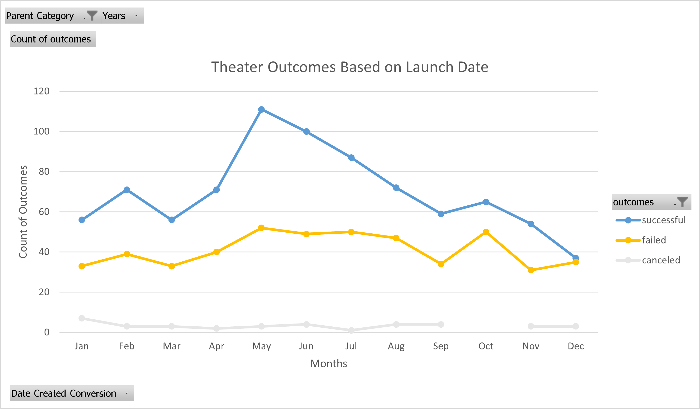
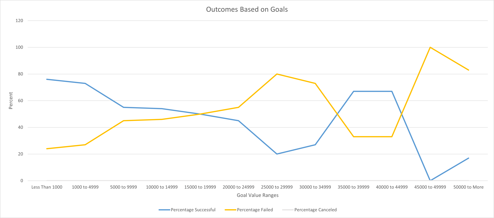

# An Analysis Report of Kickstarter Campaigns in Relation to Launch Dates and Funding Goals

### Kickstarter Campaign Analysis Overview

This analysis report aims to help visualize comparative theater campaigns by launch dates in monthly periods and set pledge goals on what trended successful, failed, and canceled campaigns.  In this analysis, there will be diagrams of two primary methods of representing data:

1. Outcomes based on launch date.
1. Outcomes based on goals.

This is in order to give a clear indication of measured success by correlating not only goals set but what timeframes to best launch a campaign.

### Analysis and Challenges

#### Analysis

In this analysis, we will review the first dataset of outcomes based on launch date to give an idea of how kickstarter theater campaigns fared by months.  In this dataset, the sample amount was a grand total of 1,369 unique campaigns collected worldwide between the years 2009 to 2017.  The formula used to determine the years in our filter is displayed in Image 1.

**Image 1**: "Excel Formula YEAR()"
	
	=YEAR(@S:S)

The majority of these campaigns did come from the US at 900, with the next largest from Great Britain at 353.  Regardless, they both averaged relatively similarly and had the biggest impact on the given data displayed in Image 2.

**Image 2**: "Theater Ouctomes Based on Launch Date"

In Image 2, we can see the highest amount of successful campaigns launched in the summer months starting in May and progressively tapering by September.  It is noted that *Fever* launched in June and with further analysis, we have to take a look at another dataset of outcomes based on pledge goals to see if there were any identifiable contributing factors on what otherwise is a great time period to launch a campaign.  In order to get the data needed another formula was required to count the number of successful, failed, and canceled plays displayed in the following Image 3.

**Image 3**: "Excel Formula COUNTIFS()"
	
	Examples:
	Number Successful - Goal Less Than 1000
		=COUNTIFS(Kickstarter!D:D,"<1000",Kickstarter!F:F,"successful",Kickstarter!R:R,"plays")
	Number Failed - Goal Less Than 1000
		=COUNTIFS(Kickstarter!D:D,"<1000",Kickstarter!F:F,"failed",Kickstarter!R:R,"plays")
	Number Canceled - Goal Less Than 1000
		=COUNTIFS(Kickstarter!D:D,"<1000",Kickstarter!F:F,"canceled",Kickstarter!R:R,"plays")

A range of goals was created that started with 1,000 or less, and increased by increments of 5,000 until we came to 50,000 or more.  The counts were collected per range and then percentages were assigned to give a clearer picture of successful campaign goal ranges displayed in Image 4.

**Image 4**: "Ouctomes Based on Goals"

Image 4 gives a very clear indicator that campaigns with pledge goals of 5,000 or less were the most successful, and going beyond that especially 15,000 trended in unfavorable risks.  However, there is an anomaly in the goal range of 35,000 to 40,000 with a decent measure of success.  The sample amount collected in that range was 6, compared to a sample collection of 785 in the Less than 1,000 to 5,000 range.  With the very small amount of samples in the higher range, it is advisable to err on the side of it being an outlier and not a clear indicator of success.  *Fever* had a pledged goal of 2,885 which is within very tolerable limits for success.  After reviewing other pieces of data, it was noted that the campaigns that were successful had on average higher amounts of backers compared to those that did not meet the pledged goals.

#### Challenges

I did run into a few challenges in the "Module 1 Challenge".  In deliverable 1, as I was creating the pivot table and inputting the rows field w/ date created conversion I was overcomplicating the table dataset by trying to change field values.  All I simply had to do was remove the auto-populated Years and Quarters from the Rows field and it left all the months with the counts of all years already included.  In deliverable 2, the formula **COUNTIFS()** threw me for a loop at the beginning as I was trying to piece the logic.  I took the advice from the instructor during the live lesson by getting an item to literally talk to as a sounding board or better known as rubberducking.  Granted there was still a bit of trial and error, many ctrl-z's, and then suddenly the data started to match and the logic started to click in my brain.  In deliverable 3, I got caught up on adding an image to the README.  I had tabbed the line for the image to help organize the flow of the report, but in doing so it inadvertently prevents the image from populating regardless if the link or markdowns are correct.  I also noticed that my **bolded** terms also did not work and I just played around until I realized that for the images to insert correctly and the bold to work those lines cannot be tabbed.

### Results

#### Two Conclusions about the Theater Outcomes by Launch Date

1. The very first data point that draws the eye is the overall amount of successful theater outcomes in the month of May and into the summer months.  This creates an appealing case of what launch dates are the best.  When viewing the chart, the visual shows the winter months as being the least successful in the overall count.
1. When viewing the line chart and with the way the data is structured it can be easily interpreted as a percentage measurement for a reader if they do not strictly understand that it's measuring overall counts per month through a range of data collected over a period of years.

#### Conclusion about the Outcomes Based on Goals

1. Immediately in the line graph in the upper range of pledged goals, we see a measure of success, but there is not enough of a sample population compared to the lower ranges for normal distribution analysis.  However, goals from 'Less than 1000' and '1000 to 4999' proved to be the most successful.

#### Limitations of the Dataset

The limitations of this dataset were with the 'Outcomes Based on Goals', as the goal increments went higher the potential for having data skewed also increased because of the overall sample size.  Given there is a great amount of data in the "Kickstarter_Challenge", as we narrowed the filters the total counts were also reduced.  Even though this is normal and the reality that theater plays will rarely reach those higher pledge goals, a strategic way to present the visual data may be to cap the incremental limit from '50,000 to more' to a lower threshold to account for any outliers and aid in the visual interpretation of the chart.

#### Recommended tables or graphs

After further investigation of just Louise's play *Fever* as an accounting point for the origin of this analysis, another dataset shown such as the average amount of backers may help illustrate further how other campaigns fared on being successful or not.  In the 'Theater Outcomes by Launch Date' I was using percentages as another method of trying to understand what months were best to launch in and it gave an interesting viewpoint compared to just total counts.  In the 'Outcomes Based on Goals' I stopped from '50,000 to more' at 35,000 to more and it helped in guiding the visual component of a significant degree of success from lower set goals compared to higher ones while incorporating the outlier in the data.  The revised charts can be seen in the attached Excel file.
